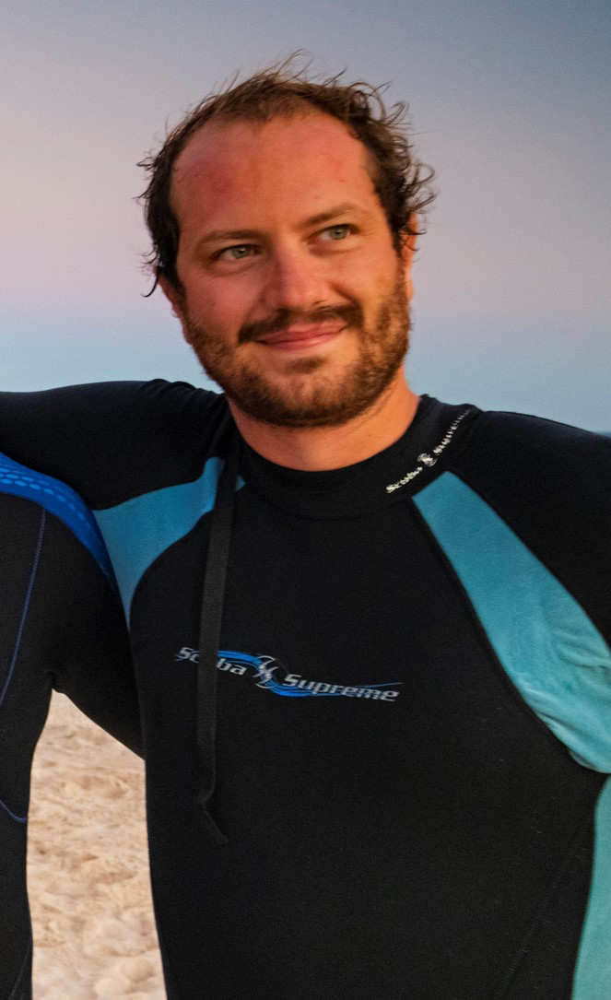

```{r, include=FALSE}
knitr::opts_chunk$set(
  results='asis', 
  echo = FALSE
)

library(glue)
library(tidyverse)

# Set this to true to have links turned into footnotes at the end of the document
PDF_EXPORT <- FALSE

# Holds all the links that were inserted for placement at the end
links <- c()

source('parsing_functions.R')

# Load csv with position info
position_data <- read_csv('positions.csv')
```


```{r}
# When in export mode the little dots are unaligned, so fix that. 
if(PDF_EXPORT){
  cat("
  <style>
  :root{
    --decorator-outer-offset-left: -6.5px;
  }
  </style>")
}
```


Aside
================================================================================


{width=100%}

```{r}
# When in export mode the little dots are unaligned, so fix that. 
if(PDF_EXPORT){
  cat("View this CV online with links at _nickstrayer.me/cv_")
} else {
  cat("[<i class='fas fa-download'></i> Download a PDF of this CV](https://github.com/nstrayer/cv/raw/master/strayer_cv.pdf)")
}
```

Contact {#contact}
--------------------------------------------------------------------------------


- <i class="fa fa-envelope"></i> favoretto.fabio@gmail.com
- <i class="fa fa-twitter"></i> FabioFavoretto
- <i class="fa fa-github"></i> github.com/fabbiologia
- <i class="fa fa-link"></i> [lab-website](https://seaecolab.netlify.com/)
- <i class="fa fa-phone"></i> +59 (612) 868-8438


Coding Skills {#skills}
--------------------------------------------------------------------------------


Experienced in

- R 
- C
- Python
- Javascript


Disclaimer {#disclaimer}
--------------------------------------------------------------------------------

Made with the R package [**pagedown**](https://github.com/rstudio/pagedown). 

The source code is available at [github.com/fabbiologia/cv](https://github.com/fabbiologia/cv).

Last updated on `r Sys.Date()`.


Main
================================================================================

Fabio Favoretto {#title}
--------------------------------------------------------------------------------


```{r}
intro_text <- "I am a marine ecologist with experience in remote sensing to study habitats and biodiversity to understand their patterns in space and time.

Currently searching for a data science position that allows me to build tools using visualization and remote sensing. 
"

cat(sanitize_links(intro_text))
```


Education {data-icon=graduation-cap data-concise=true}
--------------------------------------------------------------------------------

```{r}
print_section(position_data, 'education')
```


Research Experience {data-icon=laptop}
--------------------------------------------------------------------------------

```{r}
print_section(position_data, 'research_positions')
```


Teaching Experience {data-icon=chalkboard-teacher}
--------------------------------------------------------------------------------

::: aside
I am passionate about education. I believe that no topic is too complex if the teacher is empathetic and willing to think about new methods of approaching task. 
:::

```{r}
print_section(position_data, 'teaching_positions')
```


Selected Press (About)  {data-icon=newspaper}
--------------------------------------------------------------------------------

```{r}
print_section(position_data, 'about_me_press')
```


Selected Publications, Posters, and Talks {data-icon=book}
--------------------------------------------------------------------------------

```{r}
print_section(position_data, 'academic_articles')
```


```{r}
if(PDF_EXPORT){
  cat("
  
Links {data-icon=link}
--------------------------------------------------------------------------------

<br>


")
  
  walk2(links, 1:length(links), function(link, index){
    print(glue('{index}. {link}'))
  })
}
```


