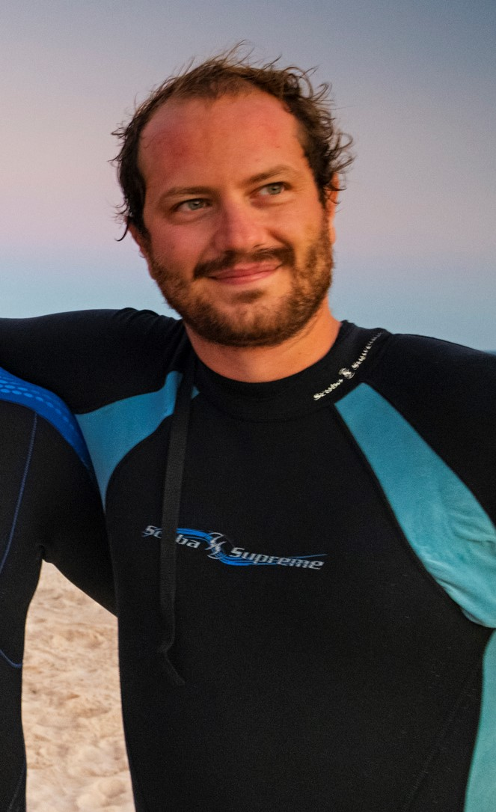

```{r, include=FALSE}
knitr::opts_chunk$set(
  results='asis', 
  echo = FALSE
)
library(tidyverse)
library(glue)

# Set this to true to have links turned into footnotes at the end of the document
PDF_EXPORT <- FALSE

# Holds all the links that were inserted for placement at the end
links <- c()

source('parsing_functions.R')


# First let's get the data, filtering to only the items tagged as
# Resume items
position_data <- read_csv('positions.csv') %>% 
  filter(in_resume) %>% 
  mutate(
    # Build some custom sections by collapsing others
    section = case_when(
      section %in% c('research_positions', 'work_positions') ~ 'positions', 
      section %in% c('academic_articles', 'by_me_press') ~ 'writings',
      TRUE ~ section
    )
  ) 

```


Aside
================================================================================


{width=100%}

Contact {#contact}
--------------------------------------------------------------------------------


- <i class="fa fa-envelope"></i> favoretto.fabio@gmail.com
- <i class="fa fa-twitter"></i> FabioFavoretto
- <i class="fa fa-github"></i> github.com/fabbiologia
- <i class="fa fa-link"></i> [lab-site](https://seaecolab.netlify.com)
- <i class="fa fa-phone"></i> +59 (612) 868-8438


Coding experience {#skills}
--------------------------------------------------------------------------------

- R 
- Python
- Javascript 


Open Source Contributions {#open-source}
--------------------------------------------------------------------------------

- [shiny dashboard for the blue-paper 10](https://seaecolab.shinyapps.io/Blue-Paper-10_dashboard/)


Disclaimer {#disclaimer}
--------------------------------------------------------------------------------

Made w/ [**pagedown**](https://github.com/rstudio/pagedown). 

Source code: [github.com/fabbiologia/cv](https://github.com/fabbiologia/cv).

Last updated on `r Sys.Date()`.


Main
================================================================================

Fabio Favoretto {#title}
--------------------------------------------------------------------------------

```{r}
intro_text <- "I am a marine ecologist with experience in remote sensing. I am interested in studing marine habitats and biodiversity to understand their patterns in space and time to aid conservation efforts.

Currently searching for a data science position that allows me to build remote sensing algorithms and ecological models with tools for visualization and interactivity that can be understood by a non technical audience
"


cat(sanitize_links(intro_text))
```


Education {data-icon=graduation-cap data-concise=true}
--------------------------------------------------------------------------------

```{r}
position_data %>% print_section('education')
```


Selected Positions {data-icon=suitcase}
--------------------------------------------------------------------------------

```{r}
position_data %>% print_section('positions')
```

Selected Articles {data-icon=newspaper}
--------------------------------------------------------------------------------


```{r}
position_data %>% print_section('writings')
```


